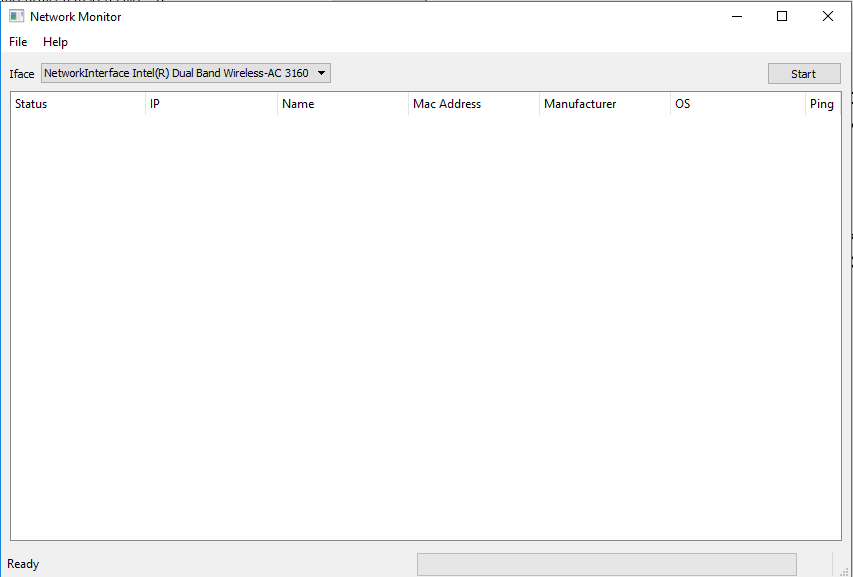
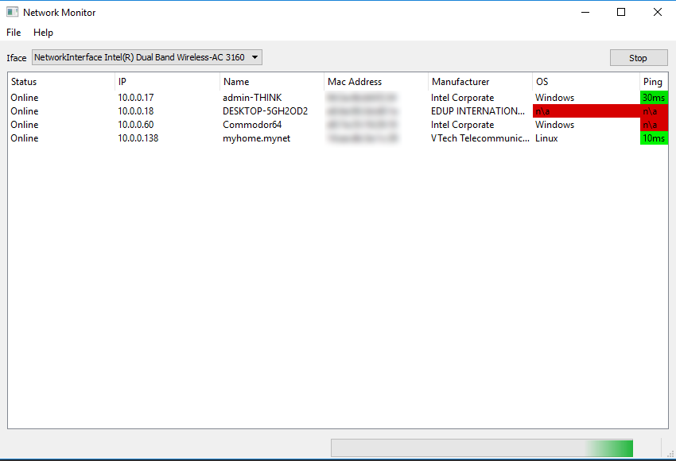
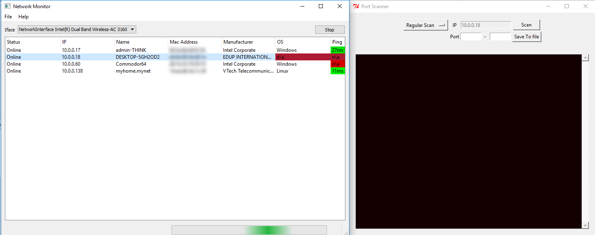

# Network Monitor

Network Monitor is a GUI project meant to give a detailed overview of all the devices on the local network. Once
activated the program will make an initial scan to find all devices and then continue to seek new devices that join the
network. Additionally, the program has the ability to export all info to a log file and it allows to make a port scan on
any of the devices.

Install
---------------

#### Windows

1. Clone the Project

  - Via HTTPS: `git clone --depth 1 https://github.com/Flodur871/Network-Montior.git`
  - via SSH:  `git clone --depth 1 git@github.com:Flodur871/Network-Montior.git`

2. Navigate into the project's folder

```
cd Network-Monitor/
```

3. Create Environment

```
python3 -m venv env
````

4. Activate the virtual environment

```
env\Scripts\activate.bat
```

5. Install dependencies

```
pip install -r requirements.txt
```

6.  Run the app

```
python monitor\main.py
```

Screenshots
---------------




